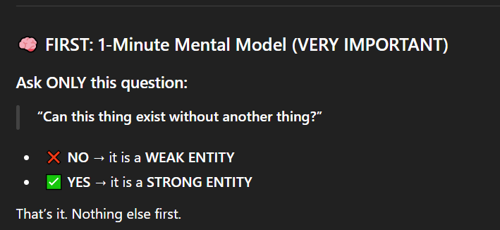
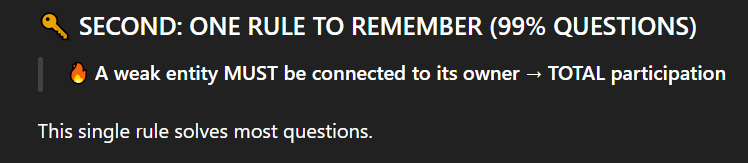
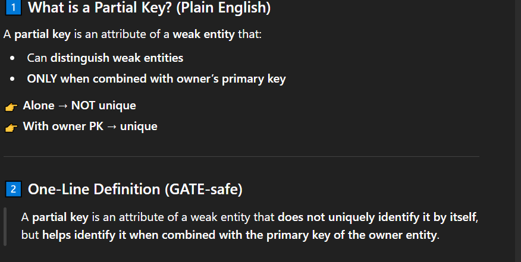
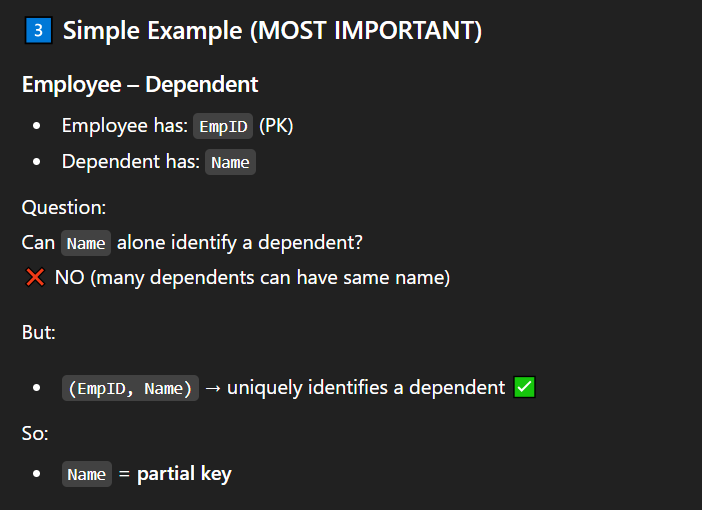
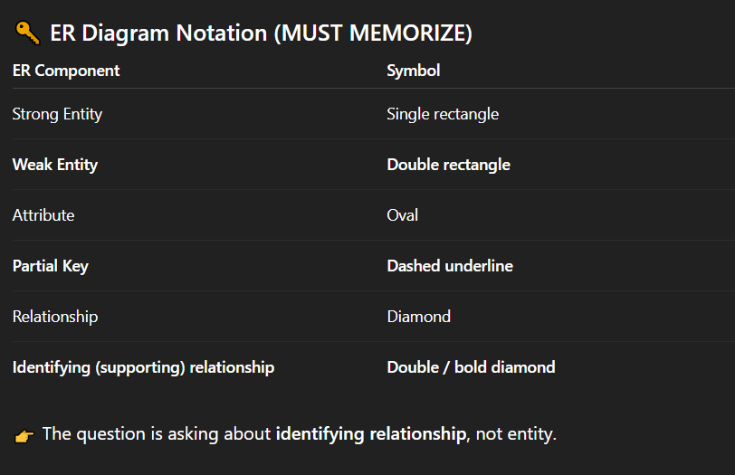
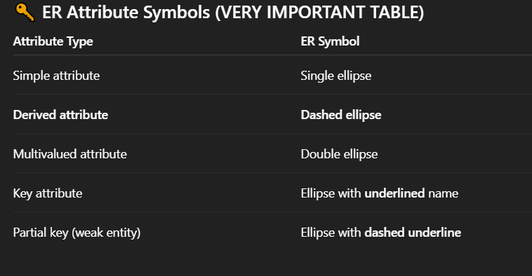
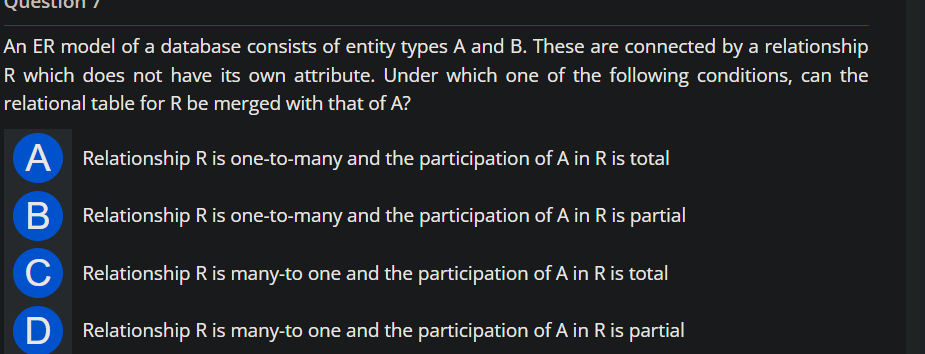

# weak entity
weak entity aisi entity jiske pass koi
like unique ki na ho so you identify hone
ke liye strong entity pe depend hota h

## ER diagram
-Entities MUST be rectangles in ER diagram.
- RELATIONSHIPS MUST be diamonds.

